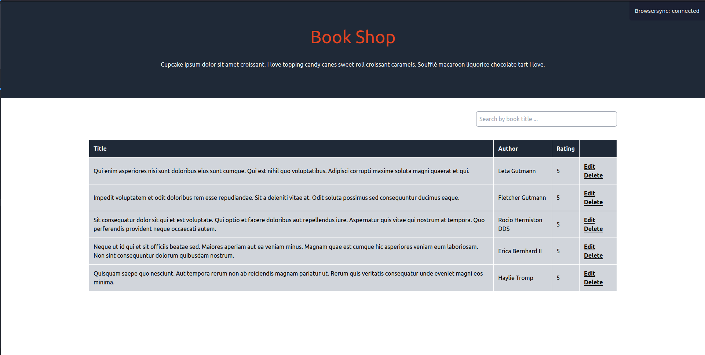

To Set Up the application run the following in the application directory
```
composer install
./vendor/bin/sail up
```
then in a new terminal run
```
docker exec -it <laravel container name> php artisan migrate
docker exec -it <laravel container name> php artisan db:seed
npm install
npm run watch
```

- Updated Landing Page: Designed and implemented the landing page to match the provided 'book-shop-listing.png' layout, incorporating a search functionality to allow users to search for book titles.
- Resolved Book Update Issue: Identified and fixed the issue preventing book updates, ensuring the update functionality works correctly and reliably.
- Enhanced Edit Book Page: Modified the Edit Book page to properly display existing book data, as shown in 'edit-book-filled.png', and enabled the successful submission of updated book information.
- Modified Seeder for Random Ratings: Updated the database seeder so that each book now receives a random rating between 1 and 10, replacing the default static rating of 5.
- Implemented Soft Delete for Books: Changed the book deletion process to implement soft deletes, preserving deleted records in the database rather than permanently removing them.
- API Enhancement for Genres: Added API functionality to create genres and associate multiple genres with individual books, without requiring any frontend changes.
- Unit Tests for BookController: Developed unit tests to validate the update method of the BookController, ensuring its accuracy and functionality.
- Verified Build Process: Ensured that the entire application, including tests, can be built and run from scratch without any issues, confirming the project’s robustness and reliability.


Designs

- 'book-shop-listing.png'


- 'edit-book-filled.png'

